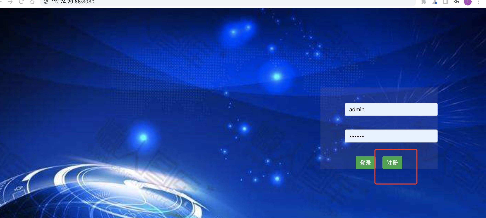

### 项目架构：

基于spring boot+websocket+html+js+sqlite3+jpa实现的一款网页聊天系统

### 技术细节：

1. 利用spring boot的自动装配机制，内嵌tomcat，搭建一个简易的运行服务器
2. 利用jpa，使得库表无需自动创建以及更新，无需手写sql语句
3. 利用sqlite3数据库，无需安装数据库服务器即可运行该系统
4. 使用javascript+jquery+jquery validate实现请求发送以及前端参数的简单校验

### 安装方式：

### 示例：http://112.74.29.66:8080/

#### 安装方式一：

1、直接下载该[安装包](https://github.com/Roaker666/BuddyChat/blob/master/releases/BuddyChat-1.0.jar)，然后运行java -jar BuddyChat-1.0.jar 运行即可

#### 安装方式二：

1. 安装java开发环境
2. 安装maven开发环境
3. 安装idea或者eclipse开发工具
4. 通过开发工具的版本管理工具克隆该服务
5. mvn clean install 或者点击开发工具上的clean再点击install生成jar包
6. 通过运行ChatApplication主函数或者java -jar BuddyChat-1.0.jar （第五步生成的jar包名）都可以

### 使用：

1、注册，运行服务器后默认进入登录页面，如果没有注册首次请点击注册按钮进入注册页面

2、登录，通过1注册后，输入用户名和密码，点击登录按钮，即可进入聊天界面；

3、即然是聊天，一个人自然不能完成，因此重新打开一个浏览器或者窗口，使用一个新的用户名注册以及登录

4、**如果A登录完成后，B再登录，此时B可以看到A，但是A看不到B，遇到这种情况请在A的聊天页面重新刷新下页面即可，这算是待解决的一个问题**

5、**还需要注意一个地方，chat.js的第五行写死了websocket的服务器地址，如果是部署在另一台机器上的话，请将这里改为该机器的地址，避免这里发送消息失败**

5、接下来就可以开始聊天了，如图所示：

